# IterationVX

**IterationT 3.2.0 + iluminación de bloques ray-traced por voxeles**, al estilo de *Rethinking Voxels*, para Minecraft con **Iris**.

IterationVX toma el shader pack IterationT (edición de Chocapic13 por Tahnass) y le injerta un sistema de iluminación de bloques completamente nuevo: el mundo se voxeliza en tiempo real y cada píxel traza rayos hacia las fuentes de luz cercanas.

---

## ✨ Características

- **Luz coloreada por bloque** — cada fuente emite su propio color: glowstone amarillo, sea lantern azulada, fuego de alma turquesa, amatista violeta, froglights, velas, lava… El color se detecta automáticamente de la textura cuando no está definido a mano.
- **Sombras ray-traced** — las antorchas y lámparas proyectan sombras nítidas contra los bloques del mundo, trazadas por rayos contra el volumen voxel (128×96×128 alrededor de la cámara).
- **Reflejos especulares ray-traced** — las luces se reflejan en superficies pulidas con su color, y el reflejo respeta las sombras.
- **Tinte a través de translúcidos** — la luz que atraviesa cristales tintados se tiñe de su color; bajo el agua la luz se vuelve azulada.
- **Sin artefactos de alcance** — el apagado de cada luz sigue exactamente el perfil de la iluminación vanilla de IterationT (modelo de modulación normalizada), así que no hay anillos ni cortes visibles.
- **Optimizado** — los píxeles sin luz de bloque no trazan nada (coste ~cero en exteriores), listas de luces por celdas con ordenación determinista, y atajos matemáticamente invisibles en escenas con muchas luces.
- **Compatible con Distant Horizons** — el terreno LOD lejano se renderiza perfectamente con el sistema voxel activo (soporte DH de IterationT intacto, incluidas las sombras DH opcionales).
- Todo lo demás de IterationT intacto: cielo, nubes volumétricas, agua, TAA, bloom, GI…

## 📸 Capturas

Comparativas en las mismas escenas: **IterationT 3.2.0 (antes)** frente a **IterationVX (después)**.

**1 — Antorcha en una cueva: sombras nítidas trazadas por rayos y luz cálida rebotando en la piedra**

| Antes | Después |
|---|---|
| 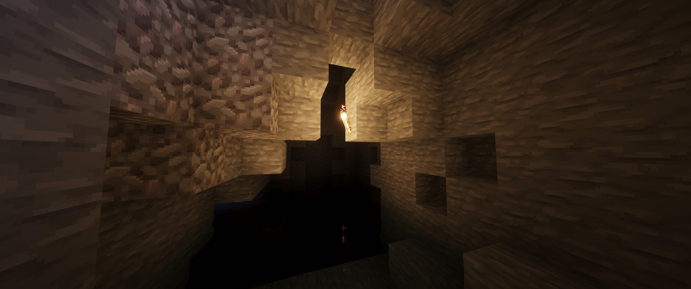 | 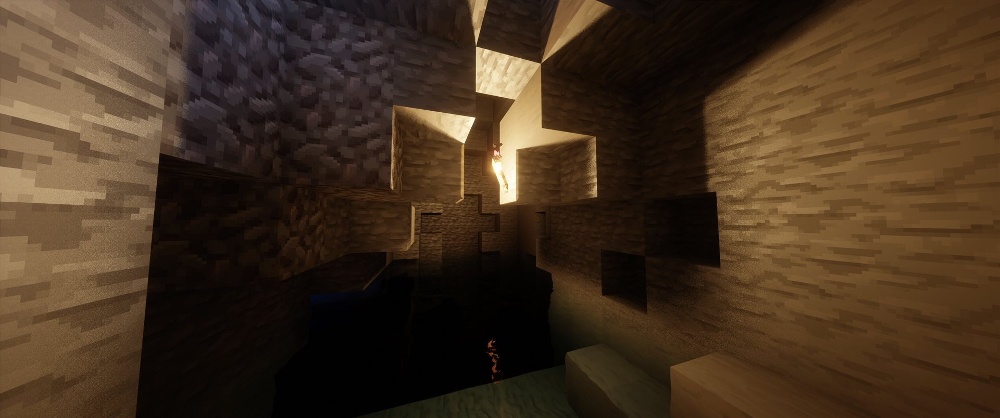 |

**2 — Luz roja: el color del emisor baña el pasillo y la pared bloquea la luz de verdad**

| Antes | Después |
|---|---|
| 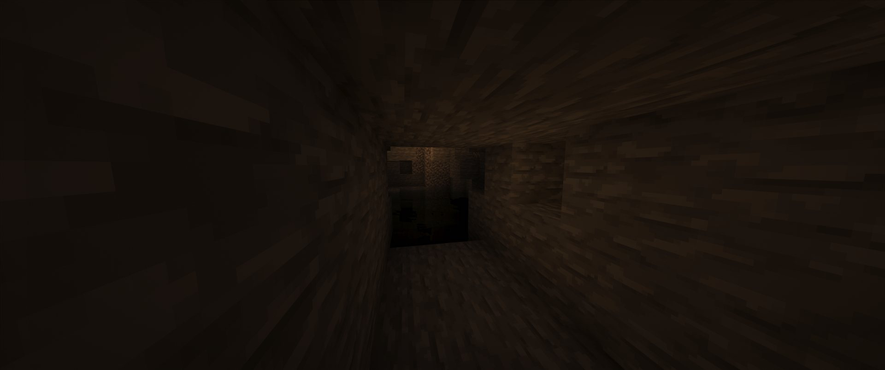 | 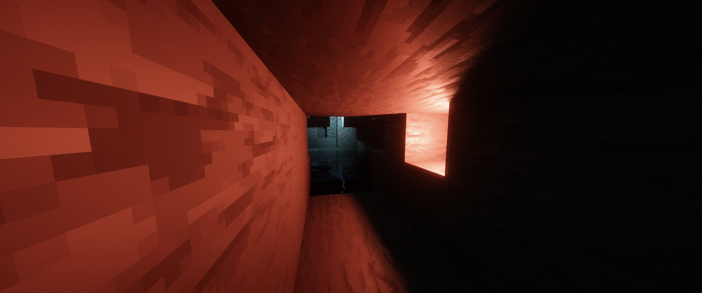 |

**3 — Fuentes de colores alternos: cada luz proyecta su propio color y sus propias sombras**

| Antes | Después |
|---|---|
| 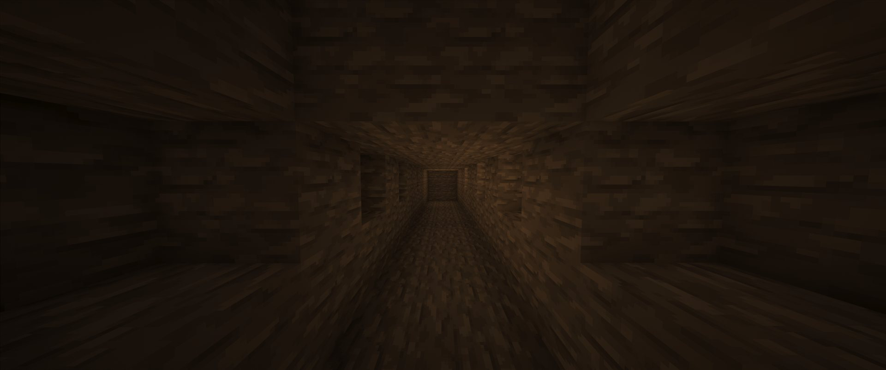 | 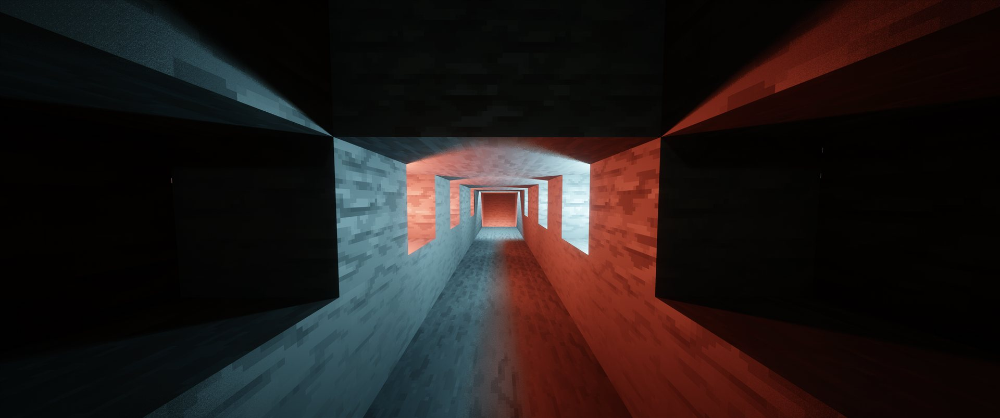 |

**4 — Luz fría entrando por una abertura: sombras largas y definidas sobre el suelo**

| Antes | Después |
|---|---|
| 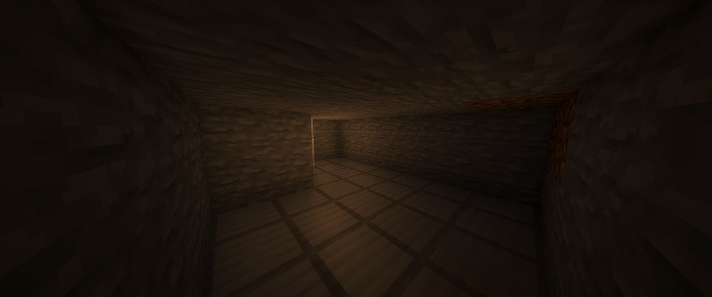 | 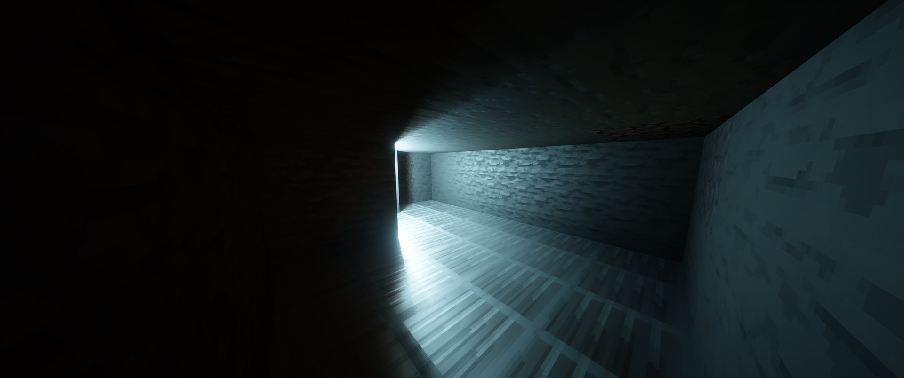 |

**5 — Luz azul: el color se detecta automáticamente y tiñe toda la sala**

| Antes | Después |
|---|---|
| 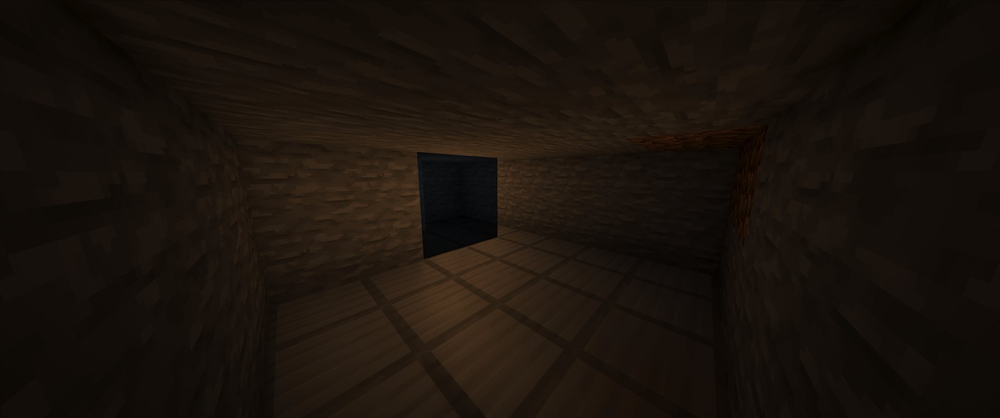 | 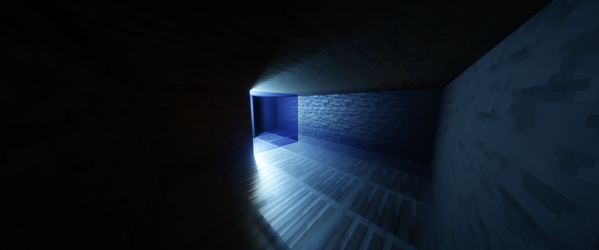 |

### 🌌 El End

El cielo del End de IterationT, intacto en IterationVX:

| | |
|---|---|
| 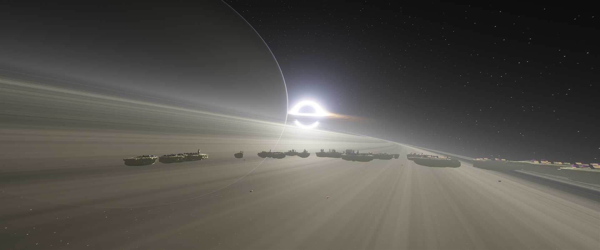 | 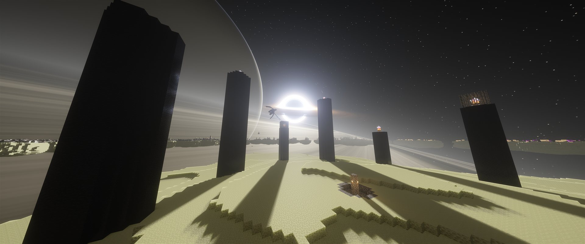 |

### 🗺️ Distant Horizons

Totalmente compatible: el terreno LOD de Distant Horizons se funde con el terreno real sin costuras, con el sistema de luz voxel funcionando a la vez.

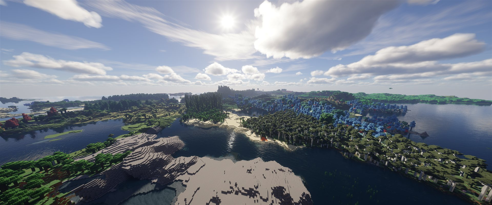

## 📋 Requisitos

| | |
|---|---|
| **Loader de shaders** | [Iris](https://irisshaders.dev/) 1.6.1 o superior — **OptiFine NO es compatible** (el sistema usa compute shaders, imágenes 3D y SSBOs) |
| **Minecraft** | Las mismas versiones que soporta IterationT 3.2.0 (1.13+, recomendado 1.18+) |
| **GPU** | Cualquiera con OpenGL 4.3 (NVIDIA / AMD / Intel modernas) |
| **Distant Horizons** | ✅ Compatible (probado con el sistema voxel activo) |

## 📥 Instalación

1. Descarga el `.zip` de la [última release](../../releases/latest).
2. Cópialo a la carpeta `shaderpacks` de tu instancia de Minecraft (no lo descomprimas).
3. En el juego: **Opciones de vídeo → Shader Packs → IterationVX** y aplica.

## ⚙️ Configuración

Menú: **Shader Pack Settings → LIGHTING → VOXEL_LIGHT**

| Opción | Descripción |
|---|---|
| `VOXEL_BLOCKLIGHT` | Interruptor general del sistema voxel |
| `VOXELLIGHT_BRIGHTNESS` | Facilidad con la que la luz trazada alcanza el brillo pleno |
| `VOXEL_DETAIL` | `1` = oclusión por bloque (hermética, recomendada). `2–4` = detalle sub-bloque **experimental** (escaleras/losas), puede fugar luz en algunas escenas |
| `VOXEL_GLASS_TINT` | Tinte de la luz al atravesar cristales tintados / agua / hielo |
| `VOXEL_SPECULAR` + `VOXEL_SPECULAR_STRENGTH` | Reflejos especulares de las luces de bloque |
| `VOXEL_LIGHT_SIZE` | Tamaño de la fuente (penumbra suave, se acumula con TAA) |
| `VOXEL_MAX_TRACES` | Rayos máximos por píxel (rendimiento) |
| `VOXEL_AMBIENT_MULT` | Luz vanilla que se conserva como rebote ambiental en zonas sombreadas |
| `VOXEL_SKIP_UNLIT` | No trazar en píxeles sin luz de bloque vanilla (gran ahorro, sin coste visual) |
| `VOXEL_LIGHT_THINNING` | Muestreo reducido en campos densos de emisores (lagos de lava) |
| `NETHER_LAVA_GLOW` | Atenúa el resplandor/bloom de la lava en el Nether |
| `VOXEL_DEBUG` | Visualiza el factor trazado crudo (diagnóstico) |

## ⚠️ Estado y limitaciones

- El **Nether** usa la iluminación original de IterationT (la voxelización requiere el shadow pass, que Iris no ejecuta allí de forma fiable). Incluye el control `NETHER_LAVA_GLOW`.
- El **End** usa la iluminación original de IterationT.
- `VOXEL_DETAIL` ≥ 2 (sombras sub-bloque) es experimental.

### 🐞 Errores conocidos

- **Slabs (losas) + lámparas**: cuando hay lámparas junto a slabs u otros bloques parciales, la iluminación puede generarse "por cubos" — se ven los bloques de la cuadrícula voxel marcados en la luz, con un efecto muy extraño. Es un error conocido y se está trabajando en resolverlo para una próxima versión. (Causa probable: la oclusión se evalúa a resolución de bloque completo, y una slab ocupa el voxel entero.)

## 🗒️ Historial de versiones

| Versión | Cambios |
|---|---|
| **v2.0** | El shader se identifica como **IterationVX 2.0** en el juego (título animado de carga y menú de opciones); galería de capturas y compatibilidad con Distant Horizons documentadas |
| v1.9 | Oclusión hermética por defecto (`VOXEL_DETAIL=1`); el detalle sub-bloque pasa a experimental |
| v1.8 | DDA de un solo eje (anti túnel de esquinas), ruido amortiguado, lámparas de cubo completo ocluyen |
| v1.7 | Revert de directivas Iris del Nether; `NETHER_LAVA_GLOW` |
| v1.6 | Optimizaciones de FPS (agua, muchas luces, lava) + `VOXEL_DEBUG` |
| v1.5 | Modelo de modulación normalizada — elimina el anillo de alcance |
| v1.4 | Envolvente de lightmap vanilla |
| v1.3 | Falloff suave estilo Frostbite |
| v1.2 | Fix de fugas (bits de presencia) + reflejos especulares ray-traced |
| v1.1 | Detalle sub-bloque, tinte de cristal/agua, soporte Nether |
| **v1.0** | Base: IterationT 3.2.0 + sistema de luz voxel ray-traced completo |

## 🙏 Créditos

- **[IterationT](https://www.curseforge.com/minecraft/shaders/iterationt)** por *Tahnass* — el shader pack base (edición de Chocapic13).
- **[Rethinking Voxels](https://modrinth.com/shader/rethinking-voxels)** por *gri573* — la inspiración y referencia técnica del sistema de iluminación voxel.
- Sistema voxel de IterationVX desarrollado con Claude (Anthropic).

Proyecto privado de uso personal. Los packs originales conservan sus respectivas licencias.
